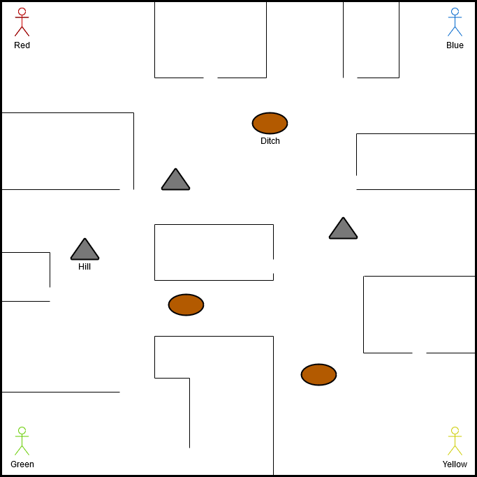
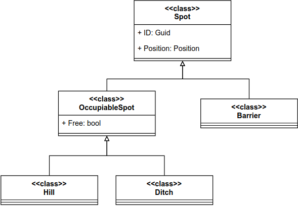

## The Environment

The default environment is a **50×50** grid. To simulate indoor laser tag conditions, the map is enclosed with barriers. Structures like barriers, rooms, hills, and ditches add complexity and enable interaction via exploration methods.




---

### Structures

Agents can interact with these environment elements by calling the appropriate `Explore*` methods (excluding `ExploreTeam` and `ExploreEnemies1`). Each exploration costs **1 ActionPoint**.



**Structure class hierarchy**

#### `Barrier`
- Cannot be occupied.
- Blocks movement and vision.
- Explored using `ExploreBarrier1`.

#### `Hill`
- Can be occupied.
- Increases both `VisualRange` and `Visibility`.
- Also increases chance of being tagged.
- Explored using `ExploreHill1`.

#### `Ditch`
- Can be occupied.
- Decreases both `VisualRange` and `Visibility`.
- Decreases chance of being tagged.
- Explored using `ExploreDitch1`.

#### `Room`
- Enclosed by barriers with small gaps for entry/exit.
- Functions as clustered tactical zones.

#### `Water`
- Cannot be occupied.
- Blocks movement but not vision.
- Explored using `ExploreWater1`.

#### `ExplosiveBarrel`
- Destructible, not occupiable.
- Does not block vision.
- Explodes when tagged, damaging agents in a radius of 3 tiles.
- Explored using `ExploreBarrels1` or `ExploreExplosiveBarrels1`.

#### `FlagStand`
- Can be occupied.
- Holds the team's flag at game start.
- In Capture the Flag mode:
  - Used to score captures.
- Explored using `ExploreEnemyFlagStands1` or `ExploreOwnFlagStand`.

---

### Items

#### `Flag`
- Belongs to a specific team.
- Starts on its team’s `FlagStand`.
- Automatically picked up by opposing agents.
- Returned instantly when touched by the owning team.

---

### Designing Your Own Maps

You can create custom environments using a CSV file.

- Shape: rectangular (n × m) or square (n × n)
- Separator: semicolon `;`
- Encoding:

```plaintext
0 → empty cell
1 → Barrier
2 → Hill
3 → Ditch
4 → Water
5 → ExplosiveBarrel
7 → FlagStand (red team)
8 → FlagStand (yellow team)
```

For examples, check the default maps in:
```
LaserTagBox/Resources/
```
